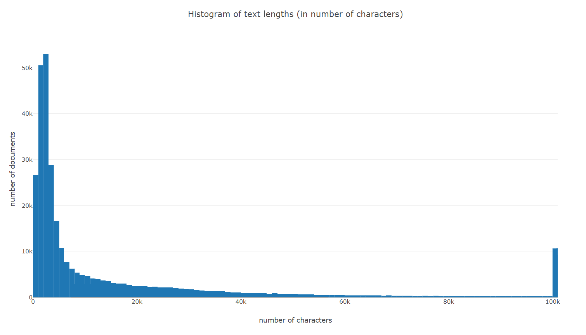

# Brief analysis of EURLEX documents

Documents can be found on atena at:

D:\Samo\Envirolens\Data grabber - EURLEX

|   | number of documents collected  |
|------|:-------:|
| ALL  | 864827  |
| at least one of (EN, DE, SL)  | 652434  |
| documents in EN (english)  |  645759 |
| documents in DE (german) | 643789  |
| documents in SL (slovene) | 515318  |

A total of **864827** documents were collected. Their total size is bigger than **20 GB**. Out of those we were able to collect data for **652434** of them in atleast one of the following languages:

* English
* German
* Slovenian

The documents that we were not able to collect include those that are not available in those 3 languages or their structure is so much different that the script was not able to extract their data.

**314445** of the documents have their full text available. The longest documents contains over **5024511** characters. Average document text contains about **20423** characters. 

Below you can see distribution of documents text sizes:

The last bin contatins all the documents that are over 100000 characters long.

## Classifications

Each document is classified in two ways:

* Classification by EUROVOC descriptrs
* Classification by subjects document is related to

### EUROVOC descriptors

In our whole dataset there are a total of **6714** distinct EUROVOC descriptors. In the table we can observe top 200 descriptors sorted by number of times they appear as a descriptor of a document.

| descriptor | number of occurences |
|---|:-:|
|EU Member State|14463|
|European Commission|13531|
|State aid|12789|
|Italy|12763|
|Spain|12062|
|United Kingdom|11171|
|import|10699|
|exchange of information|10668|
|Germany|10534|
|Greece|10276|
|France|10247|
|economic concentration|10208|
|merger control|10067|
|application of EU law|9770|
|EU aid|9678|
|environmental protection|9543|
|control of State aid|8701|
|human rights|8610|
|third country|7862|
|originating product|7833|
|EU programme|7776|
|approximation of laws|7775|
|EU financing|7349|
|import (EU)|7075|
|trademark law|6969|
|EU trade mark|6934|
|consumer protection|6531|
|Belgium|6348|
|Portugal|6195|
|United States|6119|
|public health|6088|
|health control|5953|
|award of contract|5706|
|labelling|5593|
|equal treatment|5590|
|Netherlands|5527|
|action for annulment (EU)|5438|
|interpretation of the law|5432|
|euro|5416|
|export refund|5388|
|agreement (EU)|5296|
|common agricultural policy|5212|
|foodstuff|5049|
|tariff quota|5007|
|common organisation of markets|4781|
|restriction on competition|4708|
|action programme|4707|
|market approval|4677|
|registered trademark|4654|
|marketing|4559|
|accession to the European Union|4546|
|fruit vegetable|4544|
|agricultural product|4524|
|citrus fruit|4517|
|financial aid|4510|
|Ireland|4450|
|international sanctions|4444|
|pip fruit|4361|
|vocational training|4296|
|exchange rate|4263|
|European official|4252|
|import price|4216|
|air transport|4204|
|consumer information|4129|
|statistics|4114|
|China|4085|
|environmental impact|4069|
|single market|4059|
|financial year|4058|
|aid to agriculture|4032|
|report|4009|
|small and medium-sized enterprises|3972|
|competence of the Member States|3968|
|Turkey|3918|
|infringement of EU law|3829|
|health risk|3737|
|competition|3716|
|social policy|3703|
|VAT|3654|
|sea fish|3640|
|import licence|3609|
|national law|3594|
|European Regional Development Fund|3576|
|indemnification|3530|
|designation of origin|3495|
|veterinary inspection|3420|
|economic sanctions|3417|
|tax system|3411|
|marketing standard|3408|
|environmental policy|3365|
|European Economic Area|3362|
|provision of services|3228|
|Denmark|3197|
|Community budget|3195|
|impact study|3182|
|general budget (EU)|3175|
|research and development|3171|
|export|3164|
|chemical product|3146|
|Council of the European Union|3117|
|terrorism|3101|
|Structural Funds|3095|
|proposal (EU)|3090|
|anti-dumping duty|3088|
|catch quota|3079|
|product designation|3060|
|European Parliament|3053|
|EU law|3037|
|trade policy|3009|
|investment company|3005|
|European Social Fund|2989|
|Poland|2965|
|farming sector|2928|
|technical standard|2922|
|dangerous substance|2866|
|action for failure to fulfil an obligation|2841|
|fishing area|2825|
|beef|2813|
|cereals|2808|
|fishing rights|2794|
|national implementing measure|2789|
|fund (EU)|2772|
|safety standard|2762|
|invitation to tender|2760|
|Austria|2742|
|cooperation policy|2740|
|road transport|2726|
|development aid|2721|
|free movement of goods|2720|
|quantitative restriction|2685|
|free movement of persons|2660|
|Romania|2660|
|competitiveness|2657|
|developing countries|2642|
|revision of an agreement|2630|
|CCT duties|2609|
|protocol to an agreement|2602|
|animal disease|2601|
|rail transport|2596|
|EU national|2584|
|investment|2581|
|transport policy|2578|
|disclosure of information|2568|
|innovation|2550|
|European standard|2538|
|motor vehicle|2507|
|food safety|2506|
|aid system|2495|
|European Community|2494|
|harmonisation of standards|2480|
|association agreement (EU)|2467|
|freedom to provide services|2456|
|energy policy|2454|
|economic recession|2448|
|social security|2425|
|trade restriction|2423|
|milk product|2412|
|Sweden|2409|
|data protection|2403|
|medicament|2402|
|carriage of goods|2395|
|European Union Intellectual Property Office|2393|
|the EU's international role|2385|
|food inspection|2383|
|economic support|2316|
|regional development|2293|
|Norway|2293|
|Bulgaria|2255|
|milk|2254|
|Cyprus|2252|
|protection of animals|2239|
|electrical energy|2234|
|sustainable development|2232|
|access to information|2222|
|aid to undertakings|2215|
|fraud|2210|
|derogation from EU law|2210|
|EU employment policy|2202|
|atmospheric pollution|2199|
|ratification of an agreement|2193|
|production aid|2182|
|foreign national|2145|
|product quality|2106|
|public awareness campaign|2104|
|administrative formalities|2103|
|ACP countries|2099|
|food aid|2098|
|appointment of staff|2088|
|protection of animal life|2086|
|EC Directive|2086|
|operation of the Institutions|2067|
|product safety|2059|
|financial control|2057|
|EU statistics|2054|
|regional policy|2048|
|EU relations|2044|
|maritime transport|2026|
|rice|2021|
|regional aid|2020|
|ship's flag|1998|

### Subjects

During investigating the dataset we can observe **275** different subjects. The most common one is _External relations_, followed by _Commerical policy_ and _Agriculture and Fisheries_. In the table below you can find the top 50 most common subjects sorted by the number of times they appear as a descriptor of a document.

| subject | number of occurences |
|---|:-:|
|External relations|23580|
|Commercial policy|17894|
|Agriculture and Fisheries|16018|
|Competition|13283|
|Internal market - Principles|13226|
|Approximation of laws|12366|
|Environment|12364|
|Common foreign and security policy|10941|
|Transport|10760|
|Fisheries policy|9669|
|Consumer protection|9605|
|Provisions governing the Institutions|9306|
|State aids|8260|
|Financial provisions|8068|
|Veterinary legislation|7891|
|Accession|7386|
|Social provisions|7167|
|Concentrations between undertakings|6462|
|public health|6384|
|Budget|5924|
|Foodstuffs|5384|
|Energy|4676|
|Freedom of establishment|4659|
|Technical barriers|4535|
|Association Agreement|4535|
|Information and verification|4520|
|European Free Trade Association (EFTA)|4258|
|Human rights|4226|
|Dumping|4158|
|CCT: derogations|4041|
|Taxation|3885|
|European Agricultural Guidance and Guarantee Fund (EAGGF)|3813|
|Common customs tariff|3809|
|Milk products|3741|
|Research and technological development|3587|
|Fruit and vegetables|3468|
|Free movement of goods|3445|
|Economic policy|3397|
|Justice and home affairs|3188|
|Principles, objectives and tasks of the Treaties|3162|
|Agricultural structures|2956|
|Development cooperation|2932|
|Brussels Convention of 27 September 1968|2908|
|Beef and veal|2839|
|Plant health legislation|2811|
|Cereals|2808|
|Wine|2714|
|Regional policy|2694|
|Cooperation|2564|
|Telecommunications|2537|